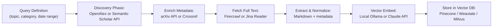

# Research Paper Sources & Tools for Agentic Ingestion

**Document purpose**: Reference guide for selecting databases and MCP servers for paper discovery, crawling, and vector DB ingestion into Second Brain / RAG pipelines.

**Last updated**: June 2026  
**Context**: Applicable to Claude-based agentic research agents, Perplexity Sonar integration, Firecrawl, and Apify platforms.

---

## 1. Source Databases

### 1.1 Open-Access Academic APIs (Free, no subscription)

**Note on IEEE papers**: Full-text article access is now available via the IEEE Xplore API, but requires active institutional subscription and separate sales agreement. If your company has IEEE Xplore access, see section 7.5 for integration guidance. For now, focus on free APIs below; IEEE integration requires institutional subscription + text & data mining (TDM) permission for non-commercial research.

#### arXiv API
- **Coverage**: 2.4M+ papers across physics, mathematics, computer science, statistics, quantitative biology  
- **Growth**: ~500+ new papers daily  
- **Endpoint**: `https://api.arxiv.org/query`  
- **Rate limit**: 3 req/sec hard limit; recommended throttle to 1 req/sec for politeness  
- **Authentication**: None required  
- **Response format**: XML (custom parser required) or use Python `arxiv` library  
- **Best for**: Physics, ML, CS preprints; real-time monitoring of emerging research  
- **Hardware angle**: Categories `cs.AR` (computer architecture), `cs.LG` (machine learning systems)

**Example query**:
```
https://api.arxiv.org/query?search_query=cat:cs.LG+AND+submittedDate:[202501010000+TO+202606190000]&start=0&max_results=100
```

#### OpenAlex API
- **Coverage**: 250M+ papers aggregating Crossref, Microsoft Academic Graph (MAG), arXiv, PubMed, ORCID, Unpaywall, institutional repos  
- **Endpoint**: `https://api.openalex.org/works`  
- **Authentication**: Optional (email parameter enables "polite pool" with faster, consistent response times)  
- **Rate limit**: Free tier unthrottled if polite (include email param)  
- **Response format**: JSON, structured schema with full DOI, venue, author affiliation data  
- **Key features**: Citation metrics, venue rankings, author-institution mapping  
- **Best for**: Bibliometric analysis, broad disciplinary coverage, citation velocity tracking

**Polite pool request**:
```
https://api.openalex.org/works?search=transformers+attention&mailto=your.email@example.com
```

#### Semantic Scholar API
- **Coverage**: 200M+ papers; exceptionally strong in CS, engineering, life sciences  
- **Endpoint**: `https://api.semanticscholar.org/graph/v1/paper/search`  
- **Rate limit**: 5,000 requests per 5 minutes without key; higher sustained limits with free API key  
- **Authentication**: Optional API key (set header `x-api-key`)  
- **Response format**: JSON with full-text-aware search, AI-generated TLDR summaries, influential citation classifier  
- **Key features**: Citation graph traversal, semantic search on abstracts, author disambiguation  
- **Best for**: CS-heavy research discovery, TLDR summaries for rapid triage, citation network analysis

#### Crossref API
- **Coverage**: 150M+ scholarly records; primary DOI registry for all major publishers  
- **Endpoint**: `https://api.crossref.org/works`  
- **Rate limit**: ~1 req/sec without User-Agent; ~25 req/sec in "polite pool" (requires descriptive User-Agent)  
- **Authentication**: None  
- **Response format**: JSON; includes citations, references, funder data  
- **Best for**: DOI lookup, publisher-level metadata, citation reference chains

#### PubMed E-utilities
- **Coverage**: 40M+ biomedical records from MEDLINE and PubMed Central  
- **Endpoints**:
  - Search: `https://eutils.ncbi.nlm.nih.gov/entrez/eutils/esearch.fcgi`  
  - Fetch: `https://eutils.ncbi.nlm.nih.gov/entrez/eutils/efetch.fcgi`  
- **Rate limit**: 10 req/sec without API key; 40 req/sec with registered API key (free from NIH)  
- **Authentication**: API key optional but recommended  
- **Key features**: MeSH term filtering, full-text links via Unpaywall integration  
- **Best for**: Biomedical research, clinical trials, life sciences (outside CS/physics scope)

#### OpenCitations
- **Coverage**: 900M+ citation edges extracted from Crossref, PubMed, ORCID, Unpaywall  
- **Endpoint**: `https://w3id.org/oc/api/v1/citations`  
- **Authentication**: None  
- **Response format**: JSON-LD (semantic web compatible)  
- **Best for**: Citation graph reconstruction, network analysis, paper influence mapping

### 1.2 Commercial/Proprietary APIs (Subscription or limited free tiers)

| API | Coverage | Auth | Free Tier | Use Case |
|-----|----------|------|-----------|----------|
| **Scopus API** (Elsevier) | 90M+ papers from 39K+ sources | Institutional subscription | None | Citation metrics, impact factors, venue rankings |
| **Web of Science API** (Clarivate) | Top-tier journals only; premium index | Institutional subscription | None | High-impact research, longitudinal studies |
| **Dimensions API** | 140M+ records including preprints, grants | Subscription | Limited free tier (~1K queries/mo) | Preprints, funding data, open-access link discovery |

---

## 2. MCP Servers for Agentic Crawling & Research

### 2.1 Search + Synthesis (Answers, not just links)

#### Perplexity Sonar MCP
**Official repository**: `@perplexity-ai/mcp-server` (npm/GitHub)

**Available models**:
- `sonar` — Real-time web search with standard reasoning (~1 sec latency)
- `sonar-pro` — Advanced reasoning with web search ($3/M input tokens, $15/M output)
- `sonar-deep-research` — Comprehensive multi-step research with citations (5–30 min; $2/M input, $8/M output, $3/M reasoning)
- `sonar-reasoning-pro` — Complex analytical reasoning for decision-making

**Pricing** (2026 update):
- Citation tokens no longer billed (cost reduction)
- Free tier: 50 requests/month with web access

**Rate limits**: 60–200 req/min (plan-dependent)

**Integration**: Claude Code, Cursor, VS Code (Windsurf), Claude Desktop via MCP config

**Key advantage**: Returns structured answers with citations instead of raw search snippets; agents get direct facts immediately

**Setup** (Claude Code):
```bash
claude mcp add perplexity --env PERPLEXITY_API_KEY="your_key_here" -- npx -y @perplexity-ai/mcp-server
```

#### Firecrawl MCP
**Repository**: `firecrawl/firecrawl-mcp-server`

**Pricing** (2026):
- Free tier: 500 credits/month (keyless, IP-rate-limited)
- Paid: $15/mo (5K credits) → $49/mo (25K credits)
- **Credit cost**: 1 credit per page for standard scrape; batch scrape 0.5 credits/page; extract/interact 2–3 credits

**Rate limits**:
- Free (keyless): 20 requests/minute, daily credit cap per IP
- Paid: 60–200 requests/minute (plan-dependent)

**Endpoints**:
- `POST /v1/scrape` — Single page, returns markdown/HTML/screenshot/JSON
- `POST /v1/crawl` — Recursive crawling from start URL; follows links up to depth/limit
- `POST /v1/search` — Web search + auto-scrape top results
- `POST /v1/map` — Site mapping (URL discovery only)
- `POST /v1/batch` — Async batch processing of multiple URLs
- `POST /v1/extract` — Structured data extraction with schema (LLM-powered or regex)

**Key features**:
- JavaScript rendering (headless browser)
- CAPTCHA + anti-bot handling (proxies + request spoofing)
- Respects robots.txt
- Exponential backoff retry logic built-in
- LLM-extraction mode for flexible data schemas

**Setup** (MCP):
```json
{
  "mcpServers": {
    "firecrawl": {
      "command": "npx",
      "args": ["-y", "firecrawl"],
      "env": {"FIRECRAWL_API_KEY": "your_key"}
    }
  }
}
```

#### Apify MCP Server
**Repository**: `apify/apify-mcp-server`

**Offering**: Access to 8,000+ pre-built Actors (scrapers, crawlers, automation workflows)

**Pricing**: Pay-per-actor-run; free tier for testing. Community actors often free. Enterprise plans available.

**Notable Actors for research papers**:

1. **arXiv Paper & Author Scraper**
   - No auth required
   - Filters: category (cs.AI, cs.LG, physics, math), topic keywords, author name, date range
   - Sort: relevance or publication date
   - Output: title, authors, abstract, categories, DOI, PDF link, submission date
   - Batch limit: up to 500 papers per run

2. **Web Crawler** (HTTP-based)
   - High-performance for non-JS sites
   - Cheerio HTML parsing
   - Supports recursive crawling + list of URLs

3. **Web Scraper** (Playwright/Puppeteer)
   - Browser-based rendering (JS execution)
   - Login support
   - Finer control over extraction logic

4. **Website Content Crawler** (Markdown extraction)
   - Designed for RAG/LLM pipelines
   - Outputs clean markdown, HTML, or plain text
   - Integrates with LangChain, LlamaIndex

**Setup**: Visit `mcp.apify.com` for one-click MCP bundle or manual config

**Key advantage**: Massive ecosystem of task-specific actors; pay only for what you use

---

### 2.2 Deep Research & Synthesis

#### Claude Deep Research (Native feature, not MCP)
- **Availability**: Built into claude.ai (Claude Pro / Team subscription)
- **Model**: Multi-step agentic search with iterative synthesis
- **Output**: Structured research reports with validated sources
- **Advantage**: No external API calls; fully controlled reasoning loop

#### Perplexity Sonar Deep Research (via MCP)
- **Model**: `sonar-deep-research`
- **Latency**: 5–30 minutes (async, comprehensive)
- **Pricing**: $2/M input tokens + $8/M output + $3/M reasoning
- **Best for**: Complex topics requiring multi-stage research, longitudinal trends, comparative analysis

---

### 2.3 Content Extraction & PDF Handling

#### Jina AI Reader MCP
- **Function**: URL-to-markdown conversion; excellent for PDFs and academic papers
- **Capabilities**: Text extraction, table parsing, image-in-text handling
- **Pricing**: Free tier generous (~100 requests/day); paid $5–50/mo
- **Format support**: PDF, HTML, arXiv preprints, general web pages
- **Endpoint**: `https://r.jina.ai/{url}` (add to headers: `Accept: application/markdown`)

#### Native PDF Viewer (Claude/artifacts)
- **Use for**: One-off analysis of uploaded PDFs
- **Limitations**: Not suitable for bulk batch processing or agentic loops

---

## 3. Recommended Architecture: Ingestion Workflow

### 3.1 Baseline Workflow (Single Agent Run)



### 3.2 Optimized for Second Brain (Nightly Agent Orchestration)

**Goal**: Minimize API costs via three-tier billing architecture (Routines, `-p` OAuth, LiteLLM router)

**Phase 1: Metadata discovery** (Routines, cloud-based, daily 1–2 AM)
- Query OpenAlex or arXiv (free, fast)
- Store paper IDs, DOIs, abstracts in local SQLite
- Route novel IDs to ingestion queue

**Phase 2: Content fetch** (Claude Code `-p`, local filesystem)
- Use Firecrawl batch endpoint to scrape PDF links and abstracts
- Store markdown in Obsidian vault
- Log fetch success/fail

**Phase 3: Vector ingestion** (LiteLLM router → Ollama or Gemini Flash)
- Chunk markdown (semantic chunking via Claude if budget allows)
- Embed locally via Ollama (zero cost) for semantic search
- Validate via lightweight Claude Haiku sanity check (optional)
- Upsert into vector DB

**Cost model**:
- **Free tier**: arXiv API, OpenAlex, Crossref queries (~0 cost)
- **Paid**: Firecrawl batch scrape (~$0.25 per 500 papers) or Apify arXiv Actor (per run)
- **Optional**: Perplexity Sonar ($1/M tokens) for weekly trend synthesis

---

## 4. Domain-Specific Guidance

### 4.1 For AI Hardware/Accelerator Research

**Key arXiv categories**:
- `cs.AR` — Computer architecture (GPU, TPU, systolic arrays)
- `cs.LG` — Machine learning systems (training, inference, optimization)
- `cs.DC` — Distributed and parallel computing
- Physics preprints: `physics.comp-gh` (computational physics)

**Recommended queries**:

**OpenAlex**:
```json
{
  "search": "roofline model GPU latency performance prediction",
  "filters": {
    "publication_year": [2023, 2024, 2025, 2026],
    "type": ["journal-article", "preprint"]
  }
}
```

**arXiv search**:
```
search_query=cat:cs.AR+AND+(GPU+OR+TPU+OR+accelerator)+AND+submittedDate:[202501010000+TO+202606190000]
```

**Trend monitoring**: Set Perplexity Deep Research task to run biweekly on emerging accelerator architectures (e.g., "recent developments in analog AI and neuromorphic computing").

### 4.2 For Biomedical Research

**Use PubMed E-utilities exclusively**; MeSH term filtering is unmatched:

```
https://eutils.ncbi.nlm.nih.gov/entrez/eutils/esearch.fcgi?db=pubmed&term=("CRISPR Cas9"[MeSH])+AND+(2023[PDAT]:2026[PDAT])&retmax=1000
```

**Supplement with**:
- Semantic Scholar for TLDR summaries
- OpenAlex for open-access link discovery (via Unpaywall integration)

---

## 5. Comparison Matrix

| Tool | Specialty | Latency | Cost | Rate Limit | Learning Curve |
|------|-----------|---------|------|-----------|-----------------|
| **OpenAlex API** | Metadata query | ~500ms | Free | Unlimited (polite) | Low |
| **Semantic Scholar** | Full-text search + TLDR | ~1–2s | Free (5K/5min) | Moderate | Low |
| **arXiv API** | CS/physics only | ~500ms | Free | 3 req/sec | Low |
| **IEEE Xplore API** | Engineering/EE papers | ~500ms–1s | Included (if subscribed) | Contact IEEE | Medium |
| **Perplexity Sonar** | Search + answers | ~1–3s | $1/M tokens | 60–200 req/min | Medium |
| **Firecrawl** | Web scrape + crawl | 2–10s | $0.0008/page | 20–200 req/min | Medium |
| **Perplexity Deep Research** | Comprehensive research | 5–30 min | $2–8/M tokens | Lower | High |
| **Apify arXiv Scraper** | Bulk paper ingestion | Variable | Pay-per-run | Actor-dependent | Medium |
| **Claude Deep Research** | Synthesis + validation | 5–15 min | Included (Pro) | N/A | Low |

---

## 6. Implementation Checklist

- [ ] **Choose primary discovery API**: OpenAlex (broad) vs. Semantic Scholar (CS-focused) vs. arXiv (physics/CS only)
- [ ] **Set up MCP integration**: Perplexity (for answers) + Firecrawl (for scraping) + Apify (optional, for bulk arXiv)
- [ ] **Configure rate limiting**: Implement exponential backoff; monitor quota via dashboard
- [ ] **Design ETL pipeline**: Query → fetch → normalize → embed → store
- [ ] **Establish cost tracking**: Firecrawl credits, Perplexity tokens, Ollama local compute
- [ ] **Test on pilot dataset**: 50–100 papers to validate extraction quality
- [ ] **Schedule nightly runs**: Cron job or Routines for daily ingestion
- [ ] **Validate vector quality**: Manual inspection of top-K retrieval results
- [ ] **Set up alerting**: Monitor ingestion failures, token overages, schema mismatches

---

## 7. Resources & References

- **arXiv**: https://arxiv.org/help/api/user-manual
- **OpenAlex**: https://docs.openalex.org/
- **Semantic Scholar**: https://api.semanticscholar.org/
- **Perplexity MCP**: https://docs.perplexity.ai/guides/mcp-server
- **Firecrawl**: https://docs.firecrawl.dev/
- **Apify**: https://apify.com/ (MCP: mcp.apify.com)
- **PubMed E-utilities**: https://www.ncbi.nlm.nih.gov/books/NBK25499/

---

## 7.5 IEEE Xplore API (Institutional Access)

If your company has an active IEEE Xplore subscription (IEL, ASPP, POP, or POP ALL), you can access papers via the IEEE Xplore API **subject to specific constraints and authentication methods**.

### 7.5.1 Overview

**IEEE Xplore Metadata API**
- **Endpoint**: `https://api.ieee.org/v1/...` (requires API key)
- **Coverage**: 5.3M+ documents (journals, conferences, magazines, standards)
- **Availability**: Metadata always accessible; full-text requires institutional subscription

### 7.5.2 API Access Tiers

**What you get with standard API (free registration)**:
- Metadata queries: titles, authors, abstracts, publication dates, DOIs, citation counts
- Conference/journal browsing
- Author affiliation data
- Reference lists

**Full-text access via API** (NEW as of 2026):
- Full-text article access is now available via the API; requires contacting IEEE sales representative
- Requires active institutional subscription + separate API contract
- Not automatic; must negotiate with IEEE

### 7.5.3 Authentication Methods for Institutional Access

**Option A: IP-based authentication (simplest for on-campus)**
- IEEE Xplore automatically recognizes users from registered IP address ranges; no credentials required
- Your IT/librarian provides IEEE with your company's IP range (specific IPs, ranges, or dynamic IP blocks)
- Works seamlessly on-campus; API calls from those IPs inherit subscription rights

**Option B: Shibboleth/OpenAthens (federated identity, supports remote access)**
- Shibboleth or Athens authentication provides secure single sign-on access for off-campus licensed users; IEEE is member of 25+ federations
- Requires institutional federation setup (typically handled by IT/librarian)
- Enables programmatic access via OAuth2 token (setup required)

**Option C: Institutional SAML (corporate/advanced)**
- Register institution with IEEE using Shibboleth/OpenAthens or SAML for federated identity
- SAML tokens can be used in API headers for enterprise integrations

### 7.5.4 API Registration & Key Generation

1. Register for free account at `https://developer.ieee.org`
2. Generate API key (X-API-Key header)
3. If institutional subscription + full-text needed: Contact IEEE sales (`onlinesupport@ieee.org`)
4. Request will be validated against your company's subscription record

### 7.5.5 API Terms & Restrictions

**Allowed uses** (per IEEE Terms of Use):
- Non-commercial educational, research, or scientific activities within Licensee's institution
- Text & data mining (TDM) for research only
- TDM permitted for non-commercial research purposes only and requires active IEEE Xplore institutional subscription

**Restrictions**:
- Cannot resell or republish IEEE full-text content
- Must obey rate limits (429 responses if exceeded)
- Cannot obfuscate institutional IP or masquerade as non-subscriber
- Must use IP address within registered subscription range if IP-authenticated

### 7.5.6 Implementation for Second Brain

**Scenario 1: IP-based access (on-campus research)**
```python
import requests

API_KEY = "your_ieee_api_key"
headers = {"X-API-Key": API_KEY}

# Query by keyword
response = requests.get(
    "https://api.ieee.org/v1/search",
    params={
        "query": "GPU roofline model",
        "open_access": False,  # include subscribed content
        "content_type": "conferences",
        "sort_order": "publication_date"
    },
    headers=headers
)

# Metadata available; full-text requires separate endpoint + subscription
papers = response.json()
for paper in papers['articles']:
    print(f"{paper['title']} - DOI: {paper['doi']}")
    # Full-text retrieval (if contract allows):
    # full_text_url = f"https://ieeexplore.ieee.org/document/{paper['article_number']}"
```

**Scenario 2: Remote access (Shibboleth/VPN)**
- Connect to company VPN or institutional Shibboleth federation
- API calls from authenticated session inherit subscription rights
- No code changes needed; authentication transparent at network layer

**Scenario 3: Full-text integration (requires IEEE sales agreement)**
- Contact IEEE for full-text API endpoint details
- Likely uses institutional credentials in request headers
- Endpoint will differ from metadata endpoint

### 7.5.7 Hybrid Strategy: IEEE + Free APIs

**Recommended workflow** (balances cost + breadth):

1. **Query free APIs first** (OpenAlex, arXiv, Semantic Scholar) for metadata discovery
2. **Cross-reference DOIs** to identify IEEE papers in result set
3. **For IEEE papers only**: Use institutional API to fetch full metadata + link to full-text
4. **Fallback**: Check arXiv for preprint version (many IEEE papers auto-posted to arXiv)

```python
# Step 1: Search OpenAlex (free, broad)
openalex_results = query_openalex("GPU roofline model")
ieee_papers = [p for p in openalex_results if "ieee" in p['venues']]

# Step 2: Fetch IEEE metadata if subscription available
for paper in ieee_papers:
    ieee_meta = query_ieee_api(doi=paper['doi'])
    # Full-text fetch depends on IEEE contract
```

### 7.5.8 Cost Considerations

- **API access**: Free (with registration)
- **Full-text via API**: Included with institutional subscription (no per-use cost if already subscribed)
- **Subscription models** (2026):
  - IEEE Electronic Library (IEL): $83K–$150K+/year (full access: journals + conferences + standards)
  - IEEE All-Society Periodicals Package (ASPP): $83,600/year
  - IEEE Proceedings Order Plan (POP): $54,450/year

**Decision**: If Lumai already has IEEE subscription, full-text API is likely included; contact your librarian or IEEE account manager.

### 7.5.9 Testing Your Access

**Check if you have API full-text access**:
```bash
# Test metadata endpoint
curl -H "X-API-Key: YOUR_KEY" \
  "https://api.ieee.org/v1/search?query=test&rows=1" | jq .

# If full-text endpoint is available (contact IEEE for URL):
curl -H "X-API-Key: YOUR_KEY" \
  "https://api.ieee.org/v1/document/{article_number}/fulltext"
```

If you get 401 or endpoint not found → full-text API not in your contract; contact IEEE sales.

---

## 8. Appendix: Quick Reference Queries

### Query by discipline

**Computer Science (broad)**:
```
OpenAlex: search:"transformer attention mechanism" AND type:article AND publication_year:[2023,2024,2025]
```

**Hardware/Architecture**:
```
arXiv: cat:cs.AR AND (roofline OR systolic OR dataflow)
```

**Biomedical**:
```
PubMed: ("deep learning"[Title/Abstract] OR "neural network"[Title/Abstract]) AND (2024[PDAT]:2026[PDAT])
```

**Economic/Financial impacts (AI chips)**:
```
OpenAlex + Firecrawl: search:"semiconductor supply chain" and crawl conference proceedings (NeurIPS, MICRO, ISCA)
```

---

**Document version**: 1.0  
**Status**: Ready for integration into Second Brain design docs  
**Next steps**: Implement Phase 1 (metadata discovery) and test arXiv API integration
