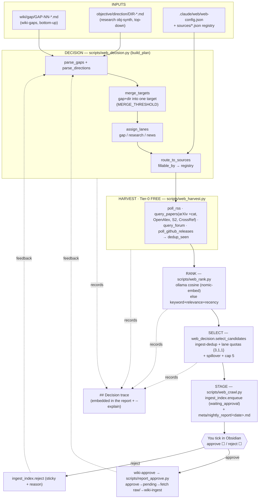

# Web Agent Workflow (Phase 3A)

How the `web` agent turns the wiki's **Gaps** and the research agent's **Directions** into a
small, ranked, **approvable** set of new sources — entirely on free ($0) routes. This is the
reference for the gap/direction → rank → decision → search/scrape flow. Every stage below names
the code that runs it, so it is tweakable, not a black box.

> One-line mental model: **collect what's missing → route each to the right free source → fetch →
> rank by relevance → keep the best 5 (by lane quota) → you approve → wiki ingests.**

---

## Pipeline at a glance

---

## Inputs

| Input | Produced by | Read by | Shape |
|---|---|---|---|
| `wiki/gap/GAP-NN-<slug>.md` (+ `index.md`) | `wiki-gaps` skill → `scripts/wiki_gaps_split.py` | `web_decision.parse_gaps` | per-gap frontmatter: `id, title, topics[], fillable_by[], priority, shows_up_in[], status` + `## Missing` body |
| `objective/direction/DIR-NNNN-*.md` | research `obj-synth` | `web_decision.parse_directions` | `serves_question, topics, targets_gap, priority, status` + `## seed_queries`, `## expected_evidence` |
| `.claude/web/web-config.json` | user-editable | `web_decision` / `web_crawl` loaders | `new_sources_total`, lane `quota`, `spillover_order`, `registry_boost`, `paid_scrape` |
| `.claude/web/sources/*.json` | the curated registry (user) | `route_to_sources` | per-source `rss_feed`/`api_endpoint`, `category`, `focus`, `relevance`, `priority` |

---

## Stages (with code references)

1. **DECISION** — `scripts/web_decision.py` → `build_plan()`
   - `parse_gaps(gap_dir)` reads `wiki/gap/GAP-*.md` (open only); `parse_directions(dir)` reads open `DIR-*`.
   - `merge_targets()` — one-to-one greedy: a direction folds into the gap it targets when their
     `targets_gap`↔gap-text Jaccard (+ small topic bonus) ≥ `MERGE_THRESHOLD` (0.18). Merged target
     keeps **origin = gap** (gaps take precedence) and uses the direction's `seed_queries` +
     `expected_evidence` as the HOW.
   - `assign_lanes()` — gap-origin → **gap**, standalone direction → **research**; `news_target()` adds one **news** target (top registry feeds).
   - `route_to_sources()` — `fillable_by`/seed-query engine-tag → registry sources, ranked by `relevance` + focus overlap (`registry_boost`). Open `WebSearch` is allowed as a lower-ranked fallback.
   - Output: a ranked list of `{target_id, lane, origin_ids, priority, queries, expected_evidence, fillable_by, routed_sources}`.

2. **HARVEST** (Tier-0, $0) — `scripts/web_harvest.py`, driven by `scripts/web_crawl.py::_harvest_target()`
   - `poll_rss` (registry feeds), `query_papers` (arXiv **with category** cs.AR/dc/lg, OpenAlex, Semantic Scholar, CrossRef), `query_forum` (HN/Reddit/Lobsters), `poll_github_releases`.
   - Calls are de-duplicated per target by `(engine, query, category)`; cross-run RSS dedup via `dedup_seen` (seen-cache). Per-item identity = `candidate_ident()` (arXiv id / DOI / URL), NOT the feed id.
   - (Tier-1 `WebFetch` of a promising URL is an agent-level step; Tier-2 paid scrapers are **Phase 3B**, gated off.)

3. **RANK** — `scripts/web_rank.py::score_candidates()` (reuses `scripts/rerank.py` ollama primitives)
   - ollama cosine vs `PURPOSE + target.expected_evidence` when `nomic-embed-text` is pulled; else a deterministic keyword + registry-relevance + recency fallback. (Embedding ranks on-topic papers far better — see the quality note in the web memory.)

4. **SELECT** — `web_decision.select_candidates()`
   - per-item dedup → ingest-dedup (drop `ingested`/`pending`/sticky-`rejected`) → fill lane **quotas** `{gap:3, research:1, news:1}` → **spillover** `gap>research>news` → cap at `new_sources_total` (5).

5. **STAGE** — `scripts/web_crawl.py::crawl()` + `_write_nightly_report()`
   - each survivor → `ingest_index.enqueue(ident, discovered_by="web", objective_ids=[GAP-/DIR-], score, rationale, published)` (status `waiting_approval`).
   - writes the **interactive** `meta/nightly_report/<date>.md`: per source an `approve`/`reject` checkbox + `published / score / lane / relevance(wikilinks) / rationale / url`, plus an embedded **`## Decision trace`**.

6. **APPROVAL → INGEST** — `wiki-approve` skill → `scripts/report_approve.py`
   - you tick boxes in Obsidian (persists to disk) → `parse_report()` → `apply(--apply)`:
     **approve** → `ingest_index.approve` (→`pending`) → wiki fetches into `raw/<type>/` → `wiki-ingest`;
     **reject** → `ingest_index.reject(reason)` (sticky). Usable manually (`/wiki-approve`) or by the nightly run (Phase 4).

7. **FEEDBACK** — the web agent reads prior `approve`/`reject(+reason)` from the ingest index to tune future crawls (persistence via `agent-learn`, Phase 4).

---

## Make it transparent (no black box)

- `python scripts/web_decision.py plan --vault <V> --explain` — the planning trace: **merge scoring table** (every gap×direction pair: jaccard/topic_bonus/total/decision), routing, lanes.
- `python scripts/web_crawl.py --vault <V> --dry-run --explain` (or `--trace-out f.md`) — the full run: harvest queries + counts, rank scores, selection (selected vs rejected-with-reason).
- Every `meta/nightly_report/<date>.md` embeds the same `## Decision trace`.
- Trace code: `web_decision.py::DecisionTrace` + `render_trace_markdown()`.

## Tune it

| Want to change | Edit |
|---|---|
| How many / what mix of sources per run | `.claude/web/web-config.json` (`new_sources_total`, lane `quota`, `spillover_order`) |
| When a direction merges into a gap | `MERGE_THRESHOLD` + the Jaccard/stoplist in `scripts/web_decision.py` |
| Which registry source a gap routes to | `route_to_sources()` + the `relevance`/`focus` in `.claude/web/sources/*.json` |
| Ranking signal | `scripts/web_rank.py` weights; pull `nomic-embed-text` for semantic cosine |
| What counts as a gap | the `wiki-gaps` skill / `scripts/wiki_gaps_split.py` (writes `wiki/gap/`) |

## Boundaries & cost

- **RBAC:** `web` writes only `meta/nightly_report/` (Write tool) + the ingest queue (`enqueue`, a Bash call); never `wiki/`/`raw/`/`objective/`; no `Edit`. Enforced by `scripts/rbac_guard.py` (`ALLOWLIST["web"]`).
- **Cost:** Phase 3A is **$0** — RSS + free APIs + local ollama rerank + native WebSearch/WebFetch. Paid scrapers are Phase 3B behind `web-config.paid_scrape.enabled` + a cost gate.
- **Cap = 5** new sources/run is the focus/"temperature" knob; **gaps take precedence** over directions; **you choose 0–5** to ingest.
