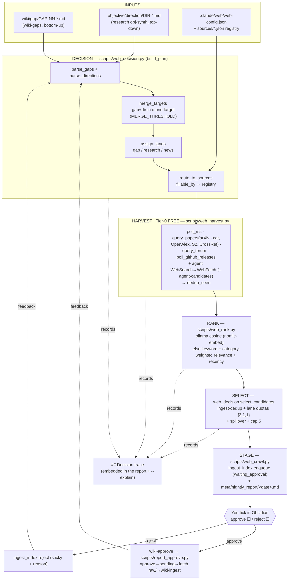

# Web Agent Workflow (Phase 3A)

How the `web` agent turns the wiki's **Gaps** and the research agent's **Directions** into a
small, ranked, **approvable** set of new sources — entirely on free ($0) routes. This is the
reference for the gap/direction → rank → decision → search/scrape flow. Every stage below names
the code that runs it, so it is tweakable, not a black box.

> One-line mental model: **collect what's missing → route each to the right free source (incl.
> agent WebSearch) → fetch → rank by relevance (diversity-reweighted) → keep the best 5 (by lane
> quota) → you approve → wiki ingests.**

---

## Pipeline at a glance

---

## Inputs

| Input | Produced by | Read by | Shape |
|---|---|---|---|
| `wiki/gap/GAP-NN-<slug>.md` (+ `index.md`) | `wiki-gaps` skill → `scripts/wiki_gaps_split.py` | `web_decision.parse_gaps` | per-gap frontmatter: `id, title, topics[], fillable_by[], priority, shows_up_in[], status` + `## Missing`/`## Why` + a `## Shows up in` body section of `[[wiki/...]]` links (real graph edges to the source pages that dictate the gap). **Note:** frontmatter is parsed as YAML incl. block lists (`fillable_by:` / `topics:` written as `- item` lines), so those fields are no longer silently dropped. |
| `objective/direction/DIR-NNNN-*.md` | research `obj-synth` | `web_decision.parse_directions` | `serves_question, topics, targets_gap, priority, status` + `## seed_queries`, `## expected_evidence` |
| `.claude/web/web-config.json` | user-editable | `web_decision` / `web_crawl` loaders | `new_sources_total`, lane `quota`, `spillover_order`, `registry_boost`, `category_weights` (+ `apply_to_embedding`), `learn`, `query` (`reformulate`), `paid_scrape` |
| `.claude/web/sources/*.json` | the curated registry (user) | `route_to_sources` | per-source `rss_feed`/`api_endpoint`, `category`, `focus`, `relevance`, `priority` |

---

## Stages (with code references)

1. **DECISION** — `scripts/web_decision.py` → `build_plan()`
   - `parse_gaps(gap_dir)` reads `wiki/gap/GAP-*.md` (open only); `parse_directions(dir)` reads open `DIR-*`.
   - `merge_targets()` — one-to-one greedy: a direction folds into the gap it targets when their
     `targets_gap`↔gap-text Jaccard (+ small topic bonus) ≥ `MERGE_THRESHOLD` (0.18). Merged target
     keeps **origin = gap** (gaps take precedence) and uses the direction's `seed_queries` +
     `expected_evidence` as the HOW.
   - `assign_lanes()` — gap-origin → **gap**, standalone direction → **research**; `news_target()` adds one **news** target (top registry feeds, `category_weights`-adjusted so vendor blogs don't monopolize the news slot).
   - Queries are **deterministic** by default: `_derive_gap_queries()` builds clean queries from the gap title + first `## Missing` sentence (stripping wikilinks/citation brackets); direction `seed_queries` are cleaned the same way. The LLM reformulation path (`web_query.py`) is retained but **off** by default (`query.reformulate: false`).
   - `route_to_sources()` — `fillable_by`/seed-query engine-tag → registry sources, ranked by `relevance` + focus overlap (`registry_boost`).
   - Output: a ranked list of `{target_id, lane, origin_ids, priority, queries, expected_evidence, fillable_by, routed_sources}`.

2. **HARVEST** (Tier-0, $0) — `scripts/web_harvest.py`, driven by `scripts/web_crawl.py::_harvest_target()`
   - `poll_rss` (registry feeds), `query_papers` (arXiv **with category** cs.AR/dc/lg, OpenAlex, Semantic Scholar, CrossRef), `query_forum` (HN/Reddit/Lobsters), `poll_github_releases`.
   - **Agent WebSearch discovery (first-class):** the `web` agent runs `WebSearch` on the gap/news queries, `WebFetch`es the on-topic hits, and hands them to `web_crawl.py --agent-candidates <file.json>` (engine `websearch`, shape `{title,url,source_id,snippet,engine,published,lane,origin_ids}`). They are merged into the SAME pool **before** dedup/rank/select, so non-registry sources (newsletters like chiplog.io, Substacks) become discoverable and are scored by the identical machinery — WebSearch **widens the funnel, it does not bypass scoring**. (Tier-2 paid scrapers remain **Phase 3B**, gated off behind `paid_scrape.enabled`.)
   - Calls are de-duplicated per target by `(engine, query, category)`; per-item identity = `candidate_ident()` (arXiv id / DOI / URL), NOT the feed id. The cross-run `dedup_seen` seen-cache now persists **only actually-staged items**, so an un-staged candidate can resurface on later runs (a daily-refreshing feed can no longer starve un-staged papers out of the budget).

3. **RANK** — `scripts/web_rank.py::score_candidates()` (reuses `scripts/rerank.py` ollama primitives)
   - ollama cosine vs `PURPOSE + target.expected_evidence` when `nomic-embed-text` is pulled; else a deterministic **keyword + category-weighted registry-relevance + recency** fallback.
   - **Source diversity by reweighting (no hard caps):** `category_weights` in web-config demotes `vendor_blogs` and boosts papers / newsletters / hardware-analysis, applied to the deterministic `rel_score` and the `news_target` feed sort. Paper candidates get registry-relevance **parity** with RSS blogs via an engine→registry-category fallback (previously only feed-id `source_id`s got the bonus, giving blogs a large head start over specific papers). The embedding (cosine) path stays pure unless `category_weights.apply_to_embedding: true` (a tunable knob).

4. **SELECT** — `web_decision.select_candidates()`
   - per-item dedup → ingest-dedup (drop `ingested`/`pending`/sticky-`rejected`) → fill lane **quotas** `{gap:3, research:1, news:1}` → **spillover** `gap>research>news` → cap at `new_sources_total` (5).

5. **STAGE** — `scripts/web_crawl.py::crawl()` + `_write_nightly_report()`
   - each survivor → `ingest_index.enqueue(ident, discovered_by="web", objective_ids=[GAP-/DIR-], score, rationale, published, url)` (status `waiting_approval`). The stored **`url`** is always a working http(s) link (arXiv ids → `https://arxiv.org/abs/<id>`).
   - writes the **interactive** `meta/nightly_report/<date>.md`: per source an `approve`/`reject` checkbox + a `- reason:` line, the attributes **`retrieved via {engine}` · `source {source_id}` · published · score · lane**, **`relevance refs`** (GAP/DIR wikilinks), **`url`**, then a **`Summary`** paragraph (≤200 words, the source's content/abstract — `_content_summary`) and a **`Relevance`** paragraph (why the web agent picked it: lane + served GAP/DIR + the `expected_evidence` it sought + score — `_relevance_paragraph`). Plus the embedded **`## Decision trace`**. (Thin-snippet sources note "fetch the URL to summarize" — an optional web-agent LLM/WebFetch enrichment can replace both paragraphs with richer prose.)

6. **APPROVAL → INGEST** — `wiki-approve` skill → `scripts/report_approve.py`
   - you tick boxes in Obsidian (persists to disk) → `parse_report()` → `apply(--apply)`:
     **approve** → (only if the row has a working URL — else it lands in `blocked[]`, never half-ingested) → `ingest_index.approve` (→`pending`) → wiki fetches into `raw/<type>/` → `wiki-ingest`;
     **reject** → `ingest_index.reject(reason)` (sticky). Usable manually (`/wiki-approve`) or by the nightly run.

7. **FEEDBACK** — `agent-learn` (`scripts/agent_learn.py`) turns prior `approve`/`reject(+reason)` decisions into per-source/engine reputation persisted in `.claude/memory/web/learned.json`, threaded into ranking (`rep_for`) and routing. **Guardrails:** free-text reject reasons are **not** harvested into reject-keywords by default (`learn.harvest_reject_keywords: false`) — this prevents a reason like "focus more on semianalysis" from becoming a penalty against that very source; and a negative **engine**-level reputation is floored at 0 in `rep_for` so a single reject cannot blanket-penalize every paper from that engine (papers carry per-item ids and would otherwise inherit the engine penalty).

---

## Make it transparent (no black box)

- `python scripts/web_decision.py plan --vault <V> --explain` — the planning trace: **merge scoring table** (every gap×direction pair: jaccard/topic_bonus/total/decision), routing, lanes.
- `python scripts/web_crawl.py --vault <V> --dry-run --explain` (or `--trace-out f.md`) — the full run: harvest queries + counts (incl. injected `agent-websearch` candidates), rank scores, selection (selected vs rejected-with-reason).
- Every `meta/nightly_report/<date>.md` embeds the same `## Decision trace`.
- Trace code: `web_decision.py::DecisionTrace` + `render_trace_markdown()`.

## Tune it

| Want to change | Edit |
|---|---|
| How many / what mix of sources per run | `.claude/web/web-config.json` (`new_sources_total`, lane `quota`, `spillover_order`) |
| When a direction merges into a gap | `MERGE_THRESHOLD` + the Jaccard/stoplist in `scripts/web_decision.py` |
| Which registry source a gap routes to | `route_to_sources()` + the `relevance`/`focus` in `.claude/web/sources/*.json` |
| Ranking signal | `scripts/web_rank.py` weights (`W_KW`/`W_REL`/`W_REC`); pull `nomic-embed-text` for semantic cosine |
| Source diversity (demote vendor blogs, boost papers/newsletters) | `category_weights` in `.claude/web/web-config.json` (+ `apply_to_embedding` to also weight the cosine path) |
| Discover non-registry URLs (newsletters, blogs) | agent `WebSearch`→`WebFetch` → `web_crawl.py --agent-candidates <file>` |
| Query style | `query.reformulate` in web-config (default `false` = deterministic gap queries) |
| Feedback strength / reject-keyword harvesting | `learn` block in web-config (`w_rep`, `w_rej`, `harvest_reject_keywords`) |
| What counts as a gap | the `wiki-gaps` skill / `scripts/wiki_gaps_split.py` (writes `wiki/gap/`) |

## Boundaries & cost

- **RBAC:** `web` writes only `meta/nightly_report/` (Write tool) + the ingest queue (`enqueue`, a Bash call); never `wiki/`/`raw/`/`objective/`; no `Edit`. Enforced by `scripts/rbac_guard.py` (`ALLOWLIST["web"]`).
- **Cost:** Phase 3A is **$0** — RSS + free APIs + local ollama rerank + native WebSearch/WebFetch. Paid scrapers are Phase 3B behind `web-config.paid_scrape.enabled` (default **false**) + a cost gate.
- **Cap = 5** new sources/run is the focus/"temperature" knob; **gaps take precedence** over directions; **you choose 0–5** to ingest.
